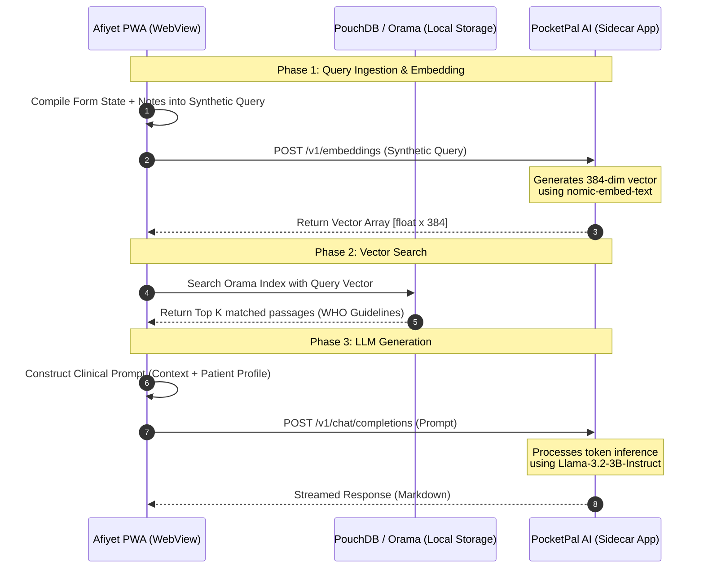

# Offline RAG Architecture: PocketPal AI + Localhost Vectoring

This document defines the production architecture for the **Afiyet PWA (`apps/pwa-app`)** using **PocketPal AI** as a local sidecar service. The system utilizes **Option 1 (Sidecar Vectoring)** to run high-accuracy semantic Retrieval-Augmented Generation (RAG) fully offline on Android tablets.

---

## 1. System Component Architecture

The architecture consists of two separate sandboxed applications running on the tablet, communicating over the local loopback interface (`localhost`).



### Components and Ports
* **Afiyet PWA (Port 5173 / Local Asset):** Runs inside the native Android WebView container. Handles patient intake forms, local PouchDB sync, and the Orama search engine.
* **PocketPal AI (Port 5001 / Localhost Server):** Runs as a background service. Exposes an OpenAI-compatible API.
  * **Model 1: `nomic-embed-text.Q4_K_M.gguf`** (Dedicated embedding model, ~200MB RAM footprint).
  * **Model 2: `llama-3.2-3b-instruct.Q4_K_M.gguf`** (Chat/Inference model, ~2.0GB RAM footprint).

---

## 2. Structured Query Synthesis (The "Synthetic Query" Concept)

Since doctors fill out structured forms (vitals, symptoms checklist, checkboxes) rather than typing conversational stories, we use a **Query Compiler** inside the PWA. This maps structured JSON state into a dense, semantic clinical paragraph optimized for vector search.

### Example Form State (PWA React State)
```json
{
  "demographics": { "age": "3 years", "gender": "female" },
  "vitals": { "temp": 39.4, "heart_rate": 130, "systolic": 90 },
  "symptoms": ["chills", "sweating", "splenomegaly", "vomiting"],
  "notes": "Lethargic child, maternal report of symptoms for 3 days. No stiff neck."
}
```

### Compiled Synthetic Query
The compiler generates a standardized text representation:
> `"Patient Profile: 3 years female. Vitals: Temperature 39.4°C, Heart Rate 130 bpm. Key Symptoms: chills, sweating, splenomegaly (enlarged spleen), vomiting. Clinical Notes: Lethargic child, maternal report of symptoms for 3 days. No stiff neck."`
*(Note the parenthetical clarification of clinical terms to bridge vocabularies between WHO documents and user input).*

---

## 3. PWA Client Integration Code (TypeScript)

This service manages the network communications and database queries inside `apps/pwa-app/src/services/ai/rag-service.ts`.

```typescript
import { search } from "@orama/orama";
import { restore } from "@orama/plugin-data-persistence";

const POCKETPAL_API = "http://localhost:5001/v1";

export class OfflineRAGService {
  private oramaDb: any = null;

  // 1. Initialize Orama by fetching and restoring the pre-compiled binary database file
  async init() {
    if (this.oramaDb) return;
    const response = await fetch("/assets/knowledge-base.msp");
    const arrayBuffer = await response.arrayBuffer();
    this.oramaDb = await restore("binary", new Uint8Array(arrayBuffer));
  }

  // 2. Fetch vector embeddings from PocketPal Localhost Server
  async getEmbedding(text: string): Promise<number[]> {
    const response = await fetch(`${POCKETPAL_API}/embeddings`, {
      method: "POST",
      headers: { "Content-Type": "application/json" },
      body: JSON.stringify({
        model: "nomic-embed-text",
        input: text,
      }),
    });

    if (!response.ok) throw new Error("PocketPal Embeddings API offline");
    const result = await response.json();
    return result.data[0].embedding;
  }

  // 3. Query local Orama Database using the generated vector
  async searchReferenceFacts(queryVector: number[], limit = 3): Promise<string[]> {
    await this.init();
    const searchResults = await search(this.oramaDb, {
      mode: "vector",
      vector: queryVector,
      similarity: 0.72, // Math threshold for relevance
      limit,
    });

    return searchResults.hits.map((hit: any) => hit.document.content);
  }

  // 4. Send complete prompt to local LLM chat endpoint
  async getLLMStream(prompt: string, onToken: (token: string) => void): Promise<void> {
    const response = await fetch(`${POCKETPAL_API}/chat/completions`, {
      method: "POST",
      headers: { "Content-Type": "application/json" },
      body: JSON.stringify({
        model: "llama-3.2-3b-instruct",
        messages: [{ role: "user", content: prompt }],
        stream: true,
      }),
    });

    if (!response.ok) throw new Error("PocketPal Chat API offline");
    
    const reader = response.body?.getReader();
    if (!reader) return;

    const decoder = new TextDecoder("utf-8");
    while (true) {
      const { done, value } = await reader.read();
      if (done) break;
      
      const chunk = decoder.decode(value);
      // Parse SSE (Server-Sent Events) chunk
      const lines = chunk.split("\n").filter(line => line.trim().startsWith("data: "));
      for (const line of lines) {
        const jsonStr = line.replace(/^data: /, "").trim();
        if (jsonStr === "[DONE]") continue;
        try {
          const parsed = JSON.parse(jsonStr);
          const token = parsed.choices[0].delta.content;
          if (token) onToken(token);
        } catch (e) {
          // Chunk splitting boundary error mitigation
        }
      }
    }
  }
}
```

---

## 4. How the Final Tablet Deployment Looks & Operates

### Directory Structure on the Tablet Storage
```text
/sdcard/Download/Afiyet/
├── afiyet-pwa.apk                  <-- The installed application UI wrapper
├── pocketpal-ai-release.apk        <-- The background server framework
└── models/
    ├── nomic-embed-text-v1.5.gguf   <-- ~200MB (Used for Step 2 of Section 1)
    └── llama-3.2-3b-instruct.gguf   <-- ~2.0GB (Used for Step 7 of Section 1)
```

### Runtime execution sequence
1. **Device Startup:** The doctor powers on the tablet (no cellular SIM, no Wi-Fi).
2. **Launch Server:** The doctor opens the PocketPal AI application. 
   - PocketPal loads both the `nomic` and `llama` GGUF files into the system RAM.
   - It hosts the loopback listener at `127.0.0.1:5001`.
3. **Launch Client:** The doctor opens the Afiyet application.
   - The WebView loads `index.html` locally from the APK assets.
   - The Service Worker registers, instantly restoring the cached, pre-compiled RAG index (`knowledge-base.msp`) into PWA memory.
4. **Form Submission:** The doctor completes a patient checkup form.
   - The app compiles inputs into a synthetic text chunk.
   - HTTP loopback fetch calls local ports to retrieve embeddings, matches reference documents in Orama, compiles the context prompt, and streams the diagnostic clinical suggestion to the UI.
